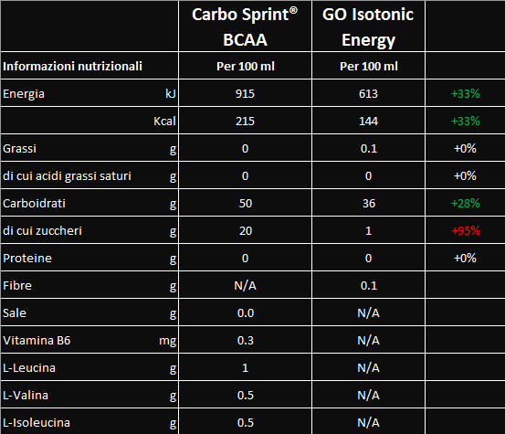
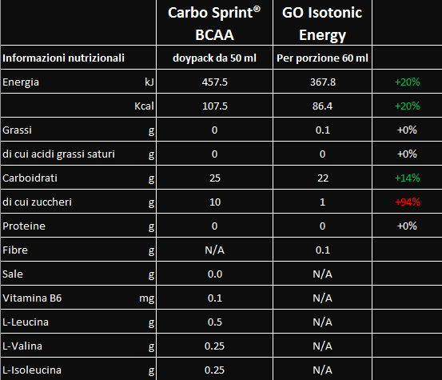

Quando sto per acquistare gli integratori che utilizzo durante le uscite in bicicletta più impegnative, mi chiedo sempre quali siano i migliori integratori per il ciclismo. Allora comincio a leggere tutti i valori nutrizionali e prendo quelli con i valori più alti. Prendevo, perché ora ho ristretto la cerchia a due marchi solamente.

Sono la SIS (Science in sport) una azienda inglese e la Pro Action un'azienda in provincia di Padova.

Sono gli unici integratori che non mi provocano mal di pancia, o comunque disturbi digestivi in generale.

Soprattutto la SIS mi da l'impressione di avere meno sostanze energetiche, ma essendo ben diluite con l'acqua sono altamente digeribili e assimilabili proprio durante il maggiore sforzo che il nostro fisico sta compiendo durante la gara o l'allenamento.

Dall'altra parte con Pro Action sento subito il mio corpo "appagato" dall'integratore, contenendo più zuccheri, soprattutto per quando riguarda i gel.

Dico subito che queste sono solo sensazioni personali, niente di scientifico, e possono variare da persona a persona. C'è chi si trova bene con un marchio di integratori piuttosto che un altro.

### Confronto tra i migliori integratori per ciclismo

Vediamo quindi sulla base dei numeri, quali sono i migliori gel per il ciclismo. Ho messo a confronto i due tipi di gel che preferisco:

[Carbo Print BCAA](https://amzn.to/2WQSdea) della Pro Action

[GO Isotonic Energy](https://amzn.to/2WURybF) della SIS

Quello che si nota subito è la concentrazione di carboidrati per 100 ml di prodotto. I Carbo Sprint BCAA della Pro Action contengono ben 50 grammi di carboidrati, circa il 50% e rispetto ai GO Isotonic Energy ne contengono quasi il 30% in più.

Da notare però che nella singola confezione, abbiamo quasi la stessa dose di carboidrati, perchè i gel SIS sono da 60 ml rispetto ai 50 ml dei Pro Action.

Un fattore da evidenziare è che nei GO Isotonic Energy gli zuccheri semplici presenti nei carboidrati sono praticamente assenti, mentre nei Carbo Sprint rappresentano circa il 40% dei carboidrati.

Questo cosa significa? Che gli zuccheri semplici da un lato sono assimilati subito dall'organismo (per questo mi danno l'idea di aiutarmi subito), ma possono provocare un picco glicemico.

Questo può portare un affaticamento del fegato, innescare un senso di fame eccessiva, ma non necessaria effettivamente all'organismo, provocare maggiore sonnolenza oltre ad essere pericoloso per gli individui che soffrono di diabete.

I Carbo Sprint in più contengono aminoacidi, vitamina B6, che sicuramente male non fa avendo un dosaggio bassissimo. Contengono anche un 20% in più di calorie che negli sport di endurance permettono di soddisfare la richiesta di energia da parte del nostro corpo.

Un'altra chicca dei Carbo Sprint è il tappo richiudibile che permette di sorseggiare il gel in più volte e anche riporre la confezione usata nelle tasche posteriori senza che i rimasugli di gel vadano a inzozzare la maglietta.

Di solito i gel li utilizzo a metà di salite lunghe e impegnative, sopra l'ora e mezza oppure quando mancano 10/20 km al termine della gara o dell'allenamento. Per questo vi consiglio di leggervi l'articolo sulle strategie di [alimentazione nel ciclismo](https://alexdelli.it/alimentazione-ciclismo-per-gare-o-allenamenti/) e pianificare i rifornimenti.

In un prossimo articolo analizzeremo anche le differenze tra le barrette energetiche.

Intanto se volete acquistare i gel descritti nell'articolo vi metto delle ottime offerte su Amazon. Se decidete infatti di fare un acquisto programmato e ricorrente si può ottenere uno sconto fino al 10% su ogni ordine.

<iframe style="width:120px;height:240px;" marginwidth="0" marginheight="0" scrolling="no" frameborder="0" src="//rcm-eu.amazon-adsystem.com/e/cm?lt1=_blank&amp;bc1=FFFFFF&amp;IS2=1&amp;bg1=FFFFFF&amp;fc1=000000&amp;lc1=0000FF&amp;t=alexdelli04-21&amp;language=it_IT&amp;o=29&amp;p=8&amp;l=as4&amp;m=amazon&amp;f=ifr&amp;ref=as_ss_li_til&amp;asins=B00GNWWTYO&amp;linkId=ea84933977555ac4abdcd4d9dc3d1612"></iframe>

<iframe style="width:120px;height:240px;" marginwidth="0" marginheight="0" scrolling="no" frameborder="0" src="//rcm-eu.amazon-adsystem.com/e/cm?lt1=_blank&amp;bc1=FFFFFF&amp;IS2=1&amp;bg1=FFFFFF&amp;fc1=000000&amp;lc1=0000FF&amp;t=alexdelli04-21&amp;language=it_IT&amp;o=29&amp;p=8&amp;l=as4&amp;m=amazon&amp;f=ifr&amp;ref=as_ss_li_til&amp;asins=B07CX6XN87&amp;linkId=ef38ecec023c37c528f7cb20174ed2b8"></iframe>

<iframe style="width:120px;height:240px;" marginwidth="0" marginheight="0" scrolling="no" frameborder="0" src="//rcm-eu.amazon-adsystem.com/e/cm?lt1=_blank&amp;bc1=FFFFFF&amp;IS2=1&amp;bg1=FFFFFF&amp;fc1=000000&amp;lc1=0000FF&amp;t=alexdelli04-21&amp;language=it_IT&amp;o=29&amp;p=8&amp;l=as4&amp;m=amazon&amp;f=ifr&amp;ref=as_ss_li_til&amp;asins=B004GHXKC8&amp;linkId=d63af945a9e1426109999c8078fc4f20"></iframe>

<iframe style="width:120px;height:240px;" marginwidth="0" marginheight="0" scrolling="no" frameborder="0" src="//rcm-eu.amazon-adsystem.com/e/cm?lt1=_blank&amp;bc1=FFFFFF&amp;IS2=1&amp;bg1=FFFFFF&amp;fc1=000000&amp;lc1=0000FF&amp;t=alexdelli04-21&amp;language=it_IT&amp;o=29&amp;p=8&amp;l=as4&amp;m=amazon&amp;f=ifr&amp;ref=as_ss_li_til&amp;asins=B00G6RM4QE&amp;linkId=6d4af8fcd8e8fb430acb6507f9f05ce5"></iframe>
