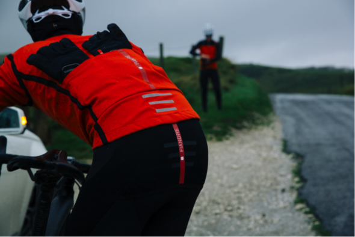
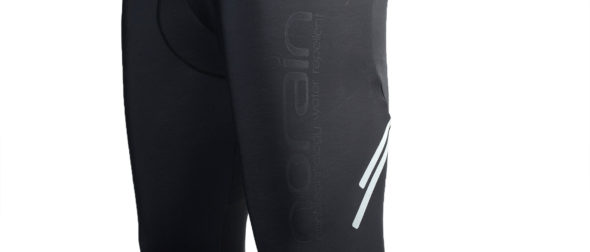

### Siete alla ricerca di una salopette per allenarvi d'inverno? Ecco **Salopette Sportful Fiandre NoRain**

**Salopette Sportful Fiandre NoRain** testata per voi: un prodotto davvero confortevole ed economico che fa al caso vostro.

[Chi è Sportful?](https://www.sportful.com/it/about-us/our-history)

Eh si, devo dire che mi sono sacrificato volentieri questa volta. Scherzi a parte, prima di parlarvi della mia nuova salopette, vi spiego come ho scelto questo prodotto.

Stavo cercando una salopette invernale per queste giornate fredde e umide. Purtroppo mi sono imbattuto subito nei prezzi esagerati dei marchi più blasonati. Ogni anno le case produttrici descrivono i nuovi prodotti come i migliori sulla faccia della terra. Aggiungono una cucitura o un disegno in più e il modello dell'anno precedente diventa subito obsoleto e di una tecnologia superata.

Così ho cercato un prodotto che non costasse una cifra folle e che allo stesso tempo risultasse affidabile e di buona fattura. Leggendo tra i forum più famosi mi sono convinto che gli sportful fiandre norain, rispecchiassero sicuramente il primo requisito e cioè non costare una follia.

\[caption id="attachment\_1288" align="aligncenter" width="590"\] Sportful Fiandre NoRain Team BibTight\[/caption\]

Appena arrivata l'ho voluta subito provare e complice il freddo di questi mesi, l'ho messa subito a dura prova.  E' indubbiamente elastica, ma indosso comprime uniformemente le gambe, senza stringere determinate zone.

Da' un senso di calore appena la si  indossa, però risulta traspirante a sufficienza per fare in modo che il sudore evaporti velocemente. Ho preso una taglia L però ho l'impressione che vesta lungo. Per questo nella zona caviglie me la trovo un po' arricciata, ma non è un problema in quanto metto dei calzini invernali a coprire.

Dopo 3 ore di allenamento la temperatura delle gambe rimane costante ed è questo l'importante. Temevo un po' che mi potesse abbandonare con il freddo e il vento, ma la zona ginocchio e coscia e bene schermata. Complice forse la protezione contro la pioggia di cui è provvista questa salopette. Non ho intenzione di provarla sotto l'acqua battente, ma in ogni caso sarei un po' scettico sul fatto che non faccia passare l'acqua.

Sul posteriore si trova una sorta di paraspruzzi per non rimanere bagnati, ma non l'ho ancora utilizzata con l'asfalto umido. Qui nel nord-est non piove da parecchio tempo purtroppo.

Sull'esterno ci sono 2 coppie di fascette riflettenti che male non fanno di cerrto in caso di poca luce.

In conclusione mi sento soddisfatto di questa salopette, soprattutto per averla pagata poco. Promossa a pieni voti

\[caption id="attachment\_1294" align="aligncenter" width="590"\] Sportful Fiandre NoRain Team BibTight\[/caption\]
