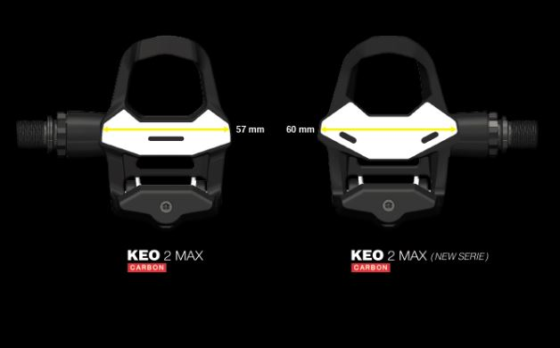
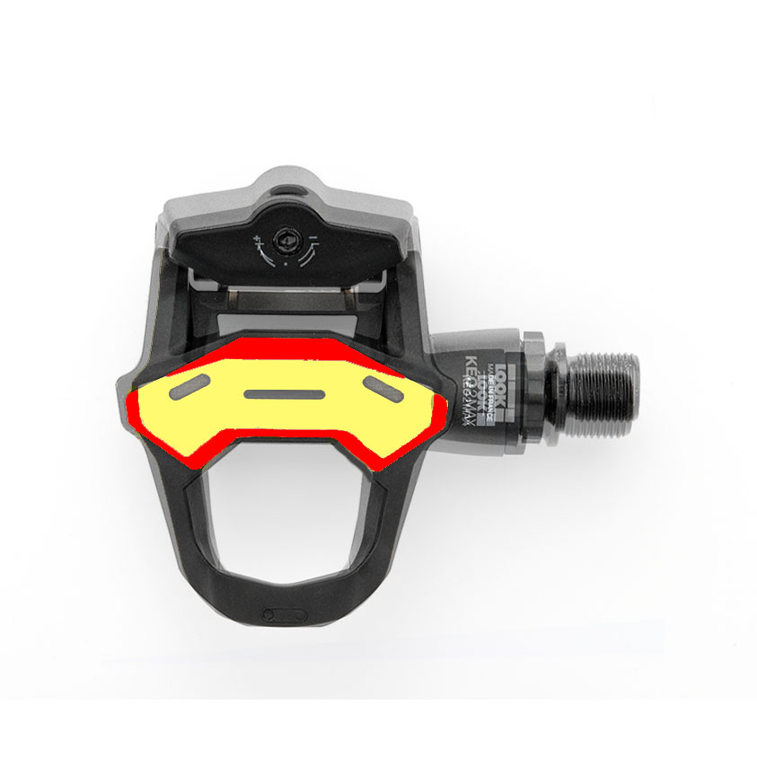
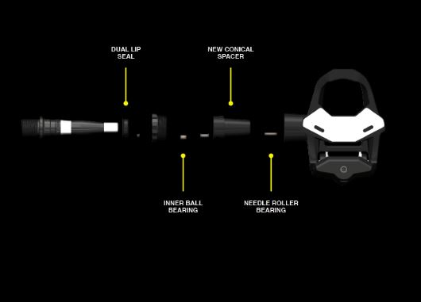

### Recensione pedali Look Keo 2 Max nuova versione 2019

Per voi oggi ecco la recensione Pedali look keo 2 max. Li potete trovare in offerta su [Amazon](https://amzn.to/2JMqNA0)

Perchè ho scelto i pedali Look Keo 2 Max ? Dovevo sostituire i miei Exustar PR200 perchè dopo 5 anni di utilizzo si erano un po' arrugginiti nella zona tra il corpo del pedale e l'asse del pedale. Insomma non erano un bel vedere.

Sono tornato quindi ai look, perchè tutto sommato mi sono sempre trovato bene e perchè sono i pedali più diffusi nel ciclismo amatoriale.

Naturalmente non appena li ho visti in offerta su Amazon ho deciso di acquistarli, anche perchè la versione 2019 promette un incremento della superficie di contatto del 25% (non poco).

Per acquistarli su Amazon vi lascio il link [Look Keo 2 Max](https://amzn.to/2JMqNA0)

#### Le caratteristiche più importanti di un pedale quali sono?

Sicuramente la superficie di appoggio tra tacchetta e pedale. Maggiore è la superficie e meglio verrà trasmessa la potenza dalle gambe alla trasmissione.

Nella versione 2019 i pedali Look keo 2 Max hanno visto un incremento del 25% della superficie di appoggio arrivando fino 500 mm, sia grazie l'aumento della larghezza del pedale che è passato da 57 a 60 mm e sia grazie ad un nuovo disegno della placca di alluminio che promette una maggiore ottimizzazione del contatto tra pedale e tacchetta.

Come si può vedere nell'immagine che ho elaborato, la zona rossa rappresenta l'incremento della superficie nella versione 2019 rispetto alla precedente.

Anche la struttura del pedale è importante. Deve trasmettere nel miglior modo possibile la potenza ed essere più rigido possibile. Sono da evitare i pedali che flettono verso il basso o alle estremità anteriore e posteriore.

Un altro fattore importante per un buon pedale è il materiale di cui è composto. Deve essere duraturo e difficilmente attaccabile dagli agenti atmosmerici.

E' stata apportata una ulteriore miglioria anche in questo caso. Nel perno in acciaio del pedale ci sono due cuscinetti collegati da una rondella zigrinata. Nella nuova versione al posto della rondella è stato inserito un distanziale conico. Questa modifica conferisce una maggiore fluidità di scorrimento, quindi la riduzione delle tolleranze, a tutto vantaggio dell'affidabilità nel tempo.

La sensazione di un bell'appoggio del piede sul pedale si sente subito rispetto ai miei exustar. Difficile dire se è avvertibile rispetto ai Look keo 2 max della vecchia versione. Parliamo di pedali molto efficienti da quel punto di vista.

Pesati con il bilanciano siamo ad un peso di 133 gr per pedale, contro 120 gr dei miei precedenti Exustar. La cosa stupefacente è che il peso rispetto alla versione 2018 è rimasto invariato. Davvero un ottimo lavoro di Look.

Esiste anche la versione Carbon che differisce dai pedali standard per una leggera diminuzione di peso. Si passa dai 130 gr della versione standard ai 125 gr dichiarati della versione Carbon. Un risparmio del 4% di peso ad un costo più alto del 18% mediamente. Ne vale davvero la pena?

Ecco il link per acquistare i pedali [Look Keo 2 max Carbon](https://amzn.to/2YBarNV)
