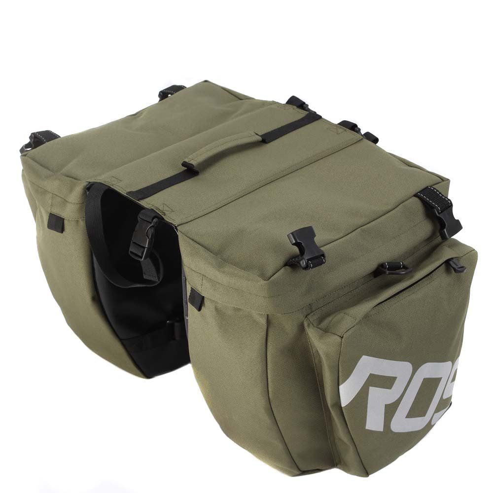
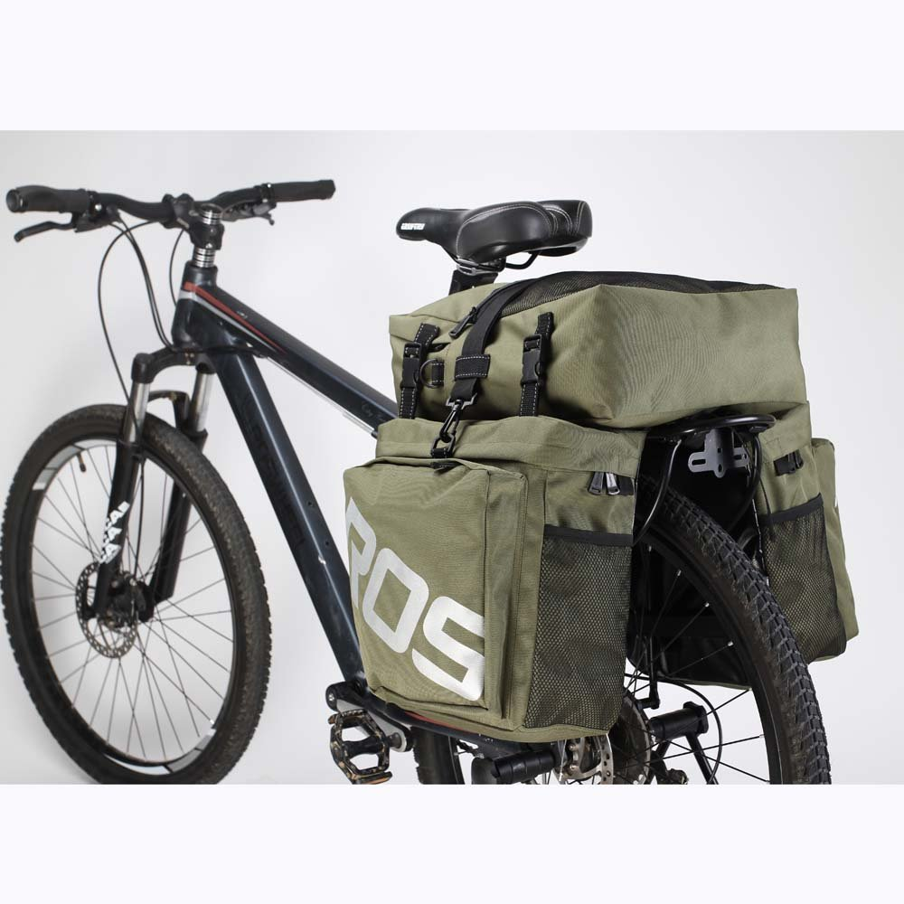
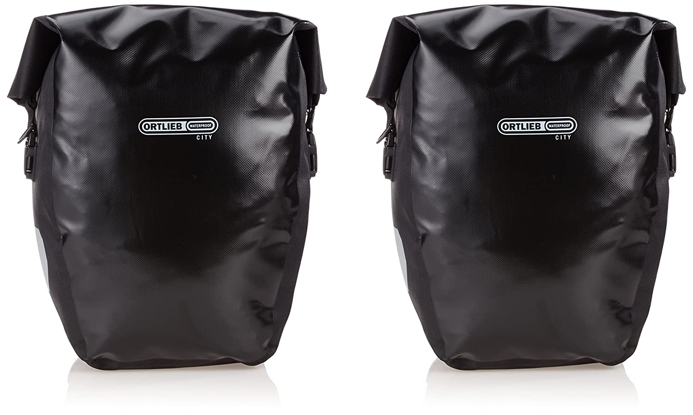
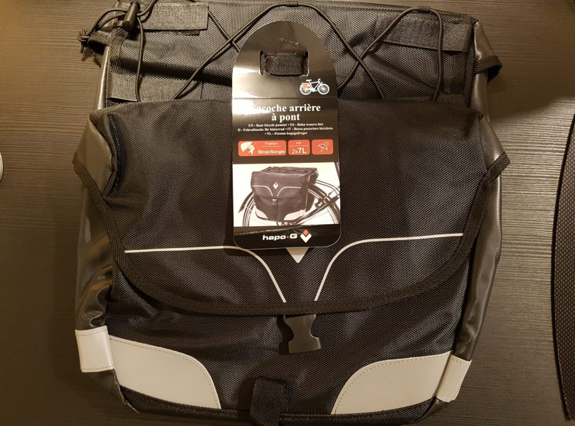
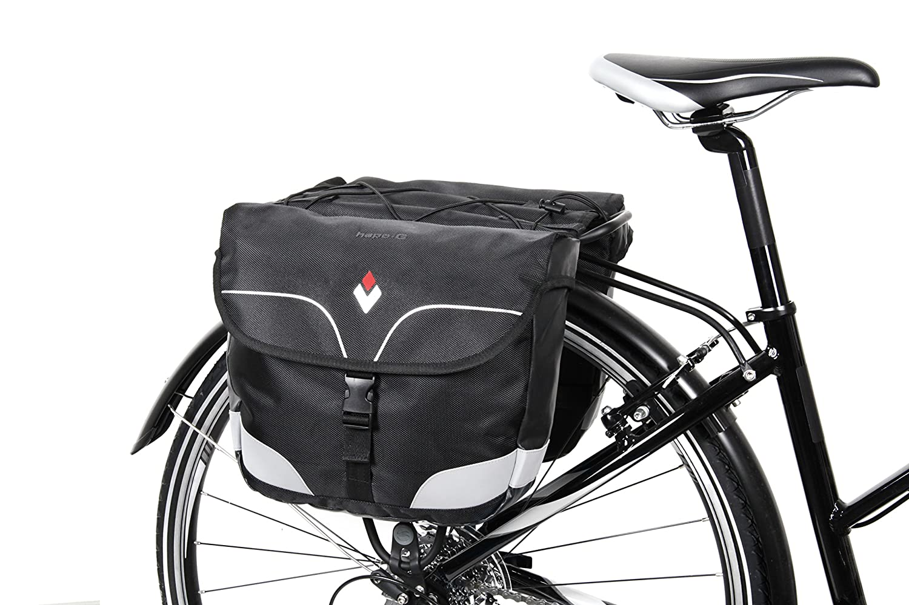
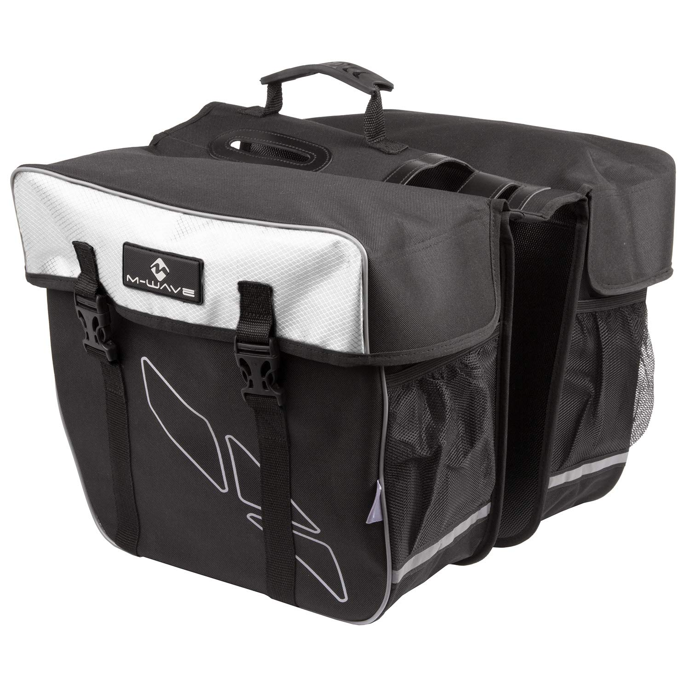

L'accessorio fondamentale per il cicloturismo, ma anche per una semplice scampagnata con familiari e amici, sono sicuramente le borse da bici per cicloturismo. Come scegliere le migliori borse da bici per cicloturismo?

Fortunatamente la scelta è molto vasta e i criteri per scegliere le borse da bici sono principalmente dettati dalle nostre esigenze, sia estetiche che funzionali.

Iniziamo a distinguere due tipi di cicloturismo. Quello con la C maiuscola, intrapreso dai ciclisti che percorrono centinaia di km in sella a mezzi specifici per questo tipo di pedalate. E quello che io chiamo "della domenica", quindi la classica scampagnata con amici e parenti, o anche da soli perchè no.

Iniziamo con i cicloturisti seri. In questo caso la caratteristiche delle borse da bici per cicloturismo sono sicuramente la **capienza**, la **resistenza** e l'**utilità**.

#### **Capienza**

Le borse da bici per cicloturismo dovranno necessariamente contenere tutto l'occorrente per affrontare tanti km, quindi eventuali ricambi di abbigliamento, scorte alimentari che sono la benzina per le gambe e parti di ricambio per il mezzo.

Diciamo che la capienza minima consigliata in questo caso è non inferiore ai 35/40 litri.

#### Resistenza

Tanti km, significano tante sollecitazioni, che sommate al peso di ciò che è contenuto all'interno delle borse lateriali, si traduce in uno stress importante per i materiali.

Per questo ci dobbiamo affidare alle ditte più famose che assicurano una manifattura garantita con materiali di qualità.

Anche gli agenti atmosferici mettono alla prova le borse laterali, sia il sole che la pioggia sono i nemici più ostici da cui difendersi.

Per la pioggia, oltre ai materiali antipioggià appunto, esistono delle coperture con cui si possono avvolgere le borse e impedire che l'acqua penetri attraverso tessuti e cerniere.

Per il sole, diciamo che solo i materiali di qualità permettono alle borse di resistere tante stagioni senza scolorimenti o irrigidimento dei tessuti che spesso portano allo squarcio delle borse.

#### Utilità

Con il termine utilità intendo tutte quelle caratteristiche "accessorie" alla caratteristica di una borsa, cioè quella di contenere.

Ad esempio ci sono modelli di borse laterali per cicloturismo che hanno degli occhielli o dei passanti che permettono di attaccare [faretti](https://alexdelli.it/consiglio-luce-posteriore-led-per-bici-da-corsa/) o catarifrangenti. Da non sottovalutare soprattutto se si pedala di sera o alle prime luci dell'alba.

Oppure alcuni modelli prevedono una sorta di ragnetto elastico per contenere oggetti a cui si deve accedere più volte e in breve tempo.

Insomma tutte quelle caratteristiche che danno valore aggiunto alle nostre borse.

### Consiglio acquisto borse da bici per cicloturismo

#### quali sono le migliori borse da bici per cicloturismo

Vi propongo una lista di borse che secondo me meritano di essere prese in considerazione per l'uso cicloturistico intenso.

#### Vaude Aqua Back

Parto quindi con il marchio che è una garanzia, VAUDE

le borse da cicloturismo sono il modello **[VAUDE Aqua Back](https://amzn.to/2vcfN4S)**

## Borse

<iframe style="width:120px;height:240px;" marginwidth="0" marginheight="0" scrolling="no" frameborder="0" src="//rcm-eu.amazon-adsystem.com/e/cm?lt1=_blank&amp;bc1=FFFFFF&amp;IS2=1&amp;bg1=FFFFFF&amp;fc1=000000&amp;lc1=0000FF&amp;t=alexdelli04-21&amp;language=it_IT&amp;o=29&amp;p=8&amp;l=as4&amp;m=amazon&amp;f=ifr&amp;ref=as_ss_li_til&amp;asins=B01LYNB1W4&amp;linkId=7267685614647cb1bf0e0da7636bfa0b"></iframe>

 

<iframe style="width:120px;height:240px;" marginwidth="0" marginheight="0" scrolling="no" frameborder="0" src="//rcm-eu.amazon-adsystem.com/e/cm?lt1=_blank&amp;bc1=FFFFFF&amp;IS2=1&amp;bg1=FFFFFF&amp;fc1=000000&amp;lc1=0000FF&amp;t=alexdelli04-21&amp;language=it_IT&amp;o=29&amp;p=8&amp;l=as4&amp;m=amazon&amp;f=ifr&amp;ref=as_ss_li_til&amp;asins=B01M18YFW6&amp;linkId=55f41410bc7468669e234e01abce8046"></iframe>

 

<iframe style="width:120px;height:240px;" marginwidth="0" marginheight="0" scrolling="no" frameborder="0" src="//rcm-eu.amazon-adsystem.com/e/cm?lt1=_blank&amp;bc1=FFFFFF&amp;IS2=1&amp;bg1=FFFFFF&amp;fc1=000000&amp;lc1=0000FF&amp;t=alexdelli04-21&amp;language=it_IT&amp;o=29&amp;p=8&amp;l=as4&amp;m=amazon&amp;f=ifr&amp;ref=as_ss_li_til&amp;asins=B01LYYXT9R&amp;linkId=8a9db1fd8922ad49260c4792416abcf0"></iframe>

 

<iframe style="width:120px;height:240px;" marginwidth="0" marginheight="0" scrolling="no" frameborder="0" src="//rcm-eu.amazon-adsystem.com/e/cm?lt1=_blank&amp;bc1=FFFFFF&amp;IS2=1&amp;bg1=FFFFFF&amp;fc1=000000&amp;lc1=0000FF&amp;t=alexdelli04-21&amp;language=it_IT&amp;o=29&amp;p=8&amp;l=as4&amp;m=amazon&amp;f=ifr&amp;ref=as_ss_li_til&amp;asins=B01LZMF3S2&amp;linkId=d54aa6a8d8b192dbe0be43c303c36d83"></iframe>

	
il prezzo è importante, ma sono qualitativamente uno scalino sopra a tutte le altre. Ce ne sono di vari colori, e in base al colore si può risparmiare qualche euro.

Hanno una capacità di 48 litri e se le acquistate state tranquilli che vi arriva un set di 2 borse.

Una caratteristica che mi piace molto di queste borse è lo "schienale" rigido. Cioè la parte che si appoggia al telaietto portapacchi è di plastica rigida e ha un sistema di fissaggio molto semplice che permette di fissare e togliere le borse molto facilmente.

Le dimensioni di ciascuna borsa (24 litri x 2) sono 37 x 33 x 19 cm.

Sono completamente impermeabili grazie ad una particolare termosaldatura e sono fatte in Germania, che non guasta mai.

#### Docooler

Per scendere di prezzo ci sono queste borse [docooler, Borsa per Mountain Bike, Multifunzione](https://amzn.to/2Irza2s)

Sono di buona fattura e presentano una serie di accessori molto interessanti. Come varie tasche esterne per inserire piccoli oggetti al volo o agganciare luci o altro. Attenzione sono impermeabili solo nella zona vicino alla ruota, mentre per una protezione totale è necessario un telo apposito.

Hanno una capienza dichiarata di 35 litri e costano poco più di 40 euro [qui](https://amzn.to/2V9ygh5)

#### Ortlieb Back Roller

Un altro marchio sinonimo di garanzia è Ortlieb con il modello di borse da bici [Back Roller City](https://amzn.to/2UmoR1j)

Costano poco più di 80 euro qui, ma sono completamente impermeabili. Hanno una capacità di 40 litri e le dimensioni sono 42x23/32x17 cm

L'unico difetto sono la mancanza di una maniglia per prenderle e le cinghie non sono allungabili, quindi se si esagera con il contenuto, si rischia di non riuscire a chiuderle.

Per fortuna sono molto capienti e anche esteticamente belle.

### Consiglio borse per gite domenicali

Le borse da bici per le gite domenicali sono molto meno esigenti dal punto di vista tecnico. In linea di massima di guarda più all'aspetto estetico e alla trasportabilità.

Come capienza siamo intorno ai 20/25 litri, quindi con ingombri ridotti che permettono di non essere di intralcio nelle passeggiate.

Non è obbligatoria l'impermeabilità, in quanto in caso di pioggia difficilmente si decide di fare la gita fuoriporta. Discorso diverso se si utilizzano per recarti al lavoro. Lo scroscio d'acqua è sempre imprevedibile.

Un fattore importante è la trasportabilità. Può capitare di utilizzare la bici per visitare un luogo di interessa come un parco o una città e necessariamente il bagaglio va portato con sé. Le borse quindi devono avere apposite maniglie e/o spallacci per il trasporto e devono avere dimensioni contenuti.

Ecco alcune borse che possono fare al caso vostro:

#### HAPO-G 11202183 Borsa posteriore

Personalmente ho scelto questo modello [HAPO-G 11202183 Borsa posteriore](https://amzn.to/2Dw6Doz)

Le trovo comode perchè sono poco profonde e ottime per trasportare materiale per pic-nic o abbigliamento. in più sono impermeabili il che non guasta certamente. Esteticamente possono piacere o non piacere, ma sono davvero fatte bene.

Come caratteristica in più hanno il comodo ragnetto elastico per infilare al volo una bottiglia d'acqua, una giacca, un pallone e altro.

Hanno una capacità di circa 14 litri e le dimensioni sono circa 33x24x8

Hanno un prezzo davvero basso se le acquistate da [qui](https://amzn.to/2PghCXE) a circa 19 euro.

HAPO-G

#### M-Wave Borsa Portapacchi Amsterdam

Parlano bene anche di queste borse da bici [M-Wave Borsa Portapacchi Amsterdam](https://amzn.to/2PhPT8Q), ma le consiglio solo se volete spendere poco ed avere delle borse molto capienti.

Hanno una capacità di 30 litri e le dimensioni sono 34 x 17 x 30 cm. Insomma un po' ingombranti per i miei gusti.

Nonostante questo si rivelano di buona fattura e molto comode sia per gite fuoriporta, ma anche per cicloturismo.

Costano solamente 22 euro se le acquistate da [qui](https://amzn.to/2PhPT8Q)

Fatemi sapere cosa ne pensate di queste borse e le vostre personali esperienze con il cicloturismo. E quali sono secondo voi le migliori borse da bici per cicloturismo?
