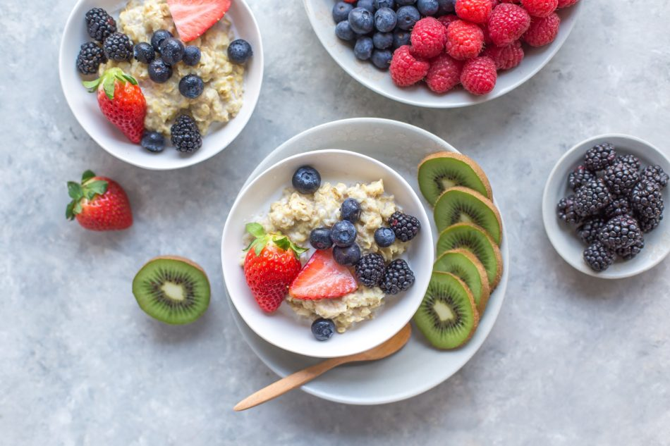

Che si tratti di una gara estenuante o di un lungo allenamento, un'alimentazione ottimale, accompagnata dall’allenamento costante e ad un ritmo sostenibile, è uno dei requisiti chiave per il successo. Se sbagli, in eccesso o in difetto, potresti avere una battuta di arresto, ridurre i benefici dell'allenamento e aumentare significativamente il tempo che dovrai recuperare dalla corsa. Vediamo dei semplici consigli sull'alimentazione nel ciclismo per gare o allenamenti.

#### Il giorno prima

Mangia normalmente il giorno prima di una grande corsa, ma presta particolare attenzione all'idratazione. Fai in modo di essere ottimamente idratato nelle 24 ore che portano alla corsa, piuttosto che dover cercare di affannarsi per recuperare al mattino, rischiando di doverti fermare ai servizi igienici più spesso di quanto sia necessario. Se il giorno prima sei in viaggio verso un evento sportivo, non fare affidamento sul cibo della stazione di servizio. Preparati un sano panino integrale, un po' di frutta e noci non salate come spuntino di metà pomeriggio. Controlla in anticipo, prenota la cena in un ristorante adatto nelle vicinanze, assicurati che l’hotel comprenda la prima colazione.

#### ore 19.00

La sera prima di una gara o di un lungo allenamento, evita di mangiare troppo tardi, o questo potrebbe impattare negativamente sulla qualità del sonno. Non c’è bisogno di piatti di pasta esagerati consumati comunemente per il concetto ormai superato del “carico di carboidrati”.

Il tuo corpo può immagazzinare solo una certa quantità di energia sotto forma di glicogeno e la combinazione della tua dieta normale e di tapering o un giorno di riposo, significano che sei probabilmente bello che già pieno. Evita la carne rossa che è pesante e difficile da digerire, ma invece opta per le proteine più leggere come pollo o pesce. Non esagerare con le fibre e stai lontano dal cibo altamente speziato. I carboidrati, sotto forma di pasta, riso o patate sono perfetti, ma ricorda che non c'è bisogno di sovraccaricare.  
Un bicchiere di vino o mezzo litro di birra non intaccheranno la tua prestazione e, sei nervoso, ti potranno aiutare a rilassarti, ma limitati ad uno solo dei due.

#### Il giorno della gara - ore 7-7.30

Imponiti di fare la colazione 90-120 minuti prima di iniziare a pedalare. Se sai che la corsa inizierà ad un ritmo molto blando e non ci sarà subito una salita significativa, si può ridurre questo tempo a 60 minuti. Il porridge è la colazione pre-giro perfetta ma, per le corse più lunghe, altre 2-3 omelette all'uovo ti daranno un po' di energia a più lento rilascio. Molti ciclisti non possono uscire senza caffè, ma assicurati almeno di mantenerti idratato e sorseggia 500 ml di acqua o di bevanda sportiva isotonica durante il tempo che precede il giro.

#### Ore 9.00

Il ritmo e il rifornimento sono intrinsecamente connessi. Se corri troppo forte, il tuo corpo non sarà capace di assorbire e utilizzare il carburante che gli stai fornendo. Stabilisci subito un ritmo che sai essere realisticamente sostenibile. Sorseggia dalla borraccia fin dall’inizio della corsa.  
Cerca di consumare 500-1000 ml di liquido per ogni ora, a seconda della tua costituzione e delle condizioni. Se tendi a dimenticarti di bere, come molti bikers fanno soprattutto in condizioni di freddo, imposta un allarme che suoni ogni 5 minuti come promemoria.

#### Ore 9.20-9.30

I carboidrati devono essere consumati precocemente, in piccole quantità e frequentemente. Trenta minuti in un giro potrebbe sembrare troppo presto, ma non stai mangiando per quel momento, ma per i 15-30 chilometri di strada a seguire. Avrai bisogno di 0,5-1g di carboidrati per kg di peso corporeo ogni ora a seconda dell'intensità, cercando di suddividere su 2-3 micro-alimentazioni ogni 20-30 minuti.  
500 ml di una comune bevanda sportiva mescolata al 6% forniscono circa 36 g di carboidrati così come gli elettroliti essenziali e, oltre a questo, un ciclista di 80-90 kg potrebbe anche consumare alcune delle opzioni sotto indicate a seconda di quanto tempo si pedala:

2 gel (22 g di carboidrati ciascuno) = 44 g  
5 biscotti ripieni (12 g di carboidrati ciascuno) = 60 g  
3 mini panetti con burro di arachidi (18 g di carboidrati ciascuno) = 54 g  
2 brioches alla marmellata (28 g di carboidrati ciascuno) = 56 g

Quindi, non è difficile assumerne abbastanza, ma altrettanto facile esagerare. Siamo tutti individui e mentre alcuni ciclisti utilizzano solo i gel, altri hanno bisogno di alimenti veri e propri. È essenziale sperimentare in allenamento quali e quanti alimenti funzionano per te. Può essere una buona strategia mangiare cibo “reale” prima in un giro e poi passare ai gel più tardi, quando non si è in grado di digerire cibo.

Il tuo corpo farà fatica ad assimilare di più e se cercherai di forzare troppo, ti sentirai gonfio e rischieresti di soffrire di disturbi gastrici. Ritmo e rifornimento sono intrinsecamente collegati e se spingi troppo forte, non sarai in grado di digerire l’alimento. Ci sono tuttavia una serie di passi da seguire per evitare problemi di stomaco in bicicletta.

Nelle sessioni di allenamento, se stai cercando di perdere peso, dovrai tenerti all’estremità inferiore di questa scala, ma dovrai prestare molta attenzione al ritmo al quale ricaverai l’energia facendo affidamento sulle scorte di grasso e il tuo corpo può accedere a queste solo ad intensità relativamente basse.

#### Ore 10

Fai il tuo secondo o terzo spuntino e finisci la prima borraccia. Mantieniti idratato costantemente e assumi una porzione di cibo ogni 20-30 minuti.  
Ad un certo punto della tua sessione di allenamento puoi fare una pausa caffè o, se sei in gara, fermati ad un punto di ristoro. Entrambe queste situazioni vanno considerate nella tua strategia di rifornimento. Se sai che stai arrivando al punto di ristoro o al bar, cerca di non mangiare nei 30 minuti precedenti. Se, per esempio, hai una grossa barretta, che conterrà circa 40 gr di carboidrati così come una decente quantità di grassi da consumare lentamente. Non è una cosa negativa, brucerai il carburante, ma dovrà essere messo in conto.

#### Il resto del giro

Mantenere la stessa strategia e disciplina per tutta la corsa. Un errore comune dei ciclisti è di perdere la concentrazione verso la fine di un giro e di trascurare il rifornimento. Se arrivi ad uno dei tuoi spuntini da 20 o 30 minuti, anche se pensi che ci siano solo un paio di chilometri da percorrere, prendi quel carburante.

Non è raro che la distanza delle gare non sia precisa al 100% o anche se ti stai solo allenando , una foratura o un problema meccanico, possono facilmente far aumentare la durata del giro.

#### Ore 13-15

Se ti sei rifocillato e hai corso ad un ritmo corretto, potresti finire il giro avendo un po’ di fame, ma non sentendoti affamato. Preparati un drink da recupero a base di proteine e carboidrati da tenere in pronto in frigo o nella borsa frigo. Questo metterà in moto il tuo recupero e farà si che mentre ti spogli, sistemi la bici e fai la doccia, recupererai già un po’ di energie.

Ti aiuterà anche ad evitare di abbuffarti quando andrai a mangiare, probabilmente in un pranzo posticipato. Questo pasto dovrebbe contenere alcune proteine di qualità e carboidrati, un panino al tonno sarebbe ideale. Se avete la possibilità di mangiare subito cibo reale, entro 20 minuti dalla fine del giro, è possibile saltare la bevanda da recupero. Anche in questa situazione, il pranzo non deve essere esagerato e uscire dalla mentalità del, “Ho corso quindi posso mangiare quello che voglio”, è la chiave se si vuole perdere un paio di chili.

#### Ore 15-17

Alcune ore dopo aver finito il giro in bici, se non ti sei alimentato correttamente durante o non abbastanza presto finita la corsa, ti sentirai molto affamato. Prendi nota e la prossima volta modifica la tua strategia di alimentazione alimentazione durante e nel post gara, se ti viene troppo facile fare razzia di biscotti e fette di torta. Si dovrebbe fare uno spuntino, ma optare per alcune noci non salate, semi e un po’ di frutta.

#### Ore 19

Ancora una volta, non usare la scusa che hai corso in bici per far fuori di tutto, a meno che stai festeggiando la fine dell’evento più importante della stagione. L’obbiettivo è una cena semplice e contenente alimenti che ti aiuteranno nel recupero e nella riduzione dell’infiammazione, piuttosto che cercare di integrare tutte le calorie consumate. Sono perfetti certi pesci come lo sgombro, con dei broccoli e delle patate speziate, seguiti da delle bacche.

Insomma come avrai capito l'alimentazione nel ciclismo per gare o allenamenti è da considerarsi alla stregua dell'allenamento. Non si può trascurare nessuna delle due variabili.

Vi consiglio la lettura di questo articolo sui [migliori integratori per il cislismo](https://alexdelli.it/migliori-integratori-per-ciclismo/)

#### Featured image thanks to:

[unsplash-logoVictor Xok](https://unsplash.com/@xokvictor?utm_medium=referral&utm_campaign=photographer-credit&utm_content=creditBadge "Download free do whatever you want high-resolution photos from Victor Xok")
